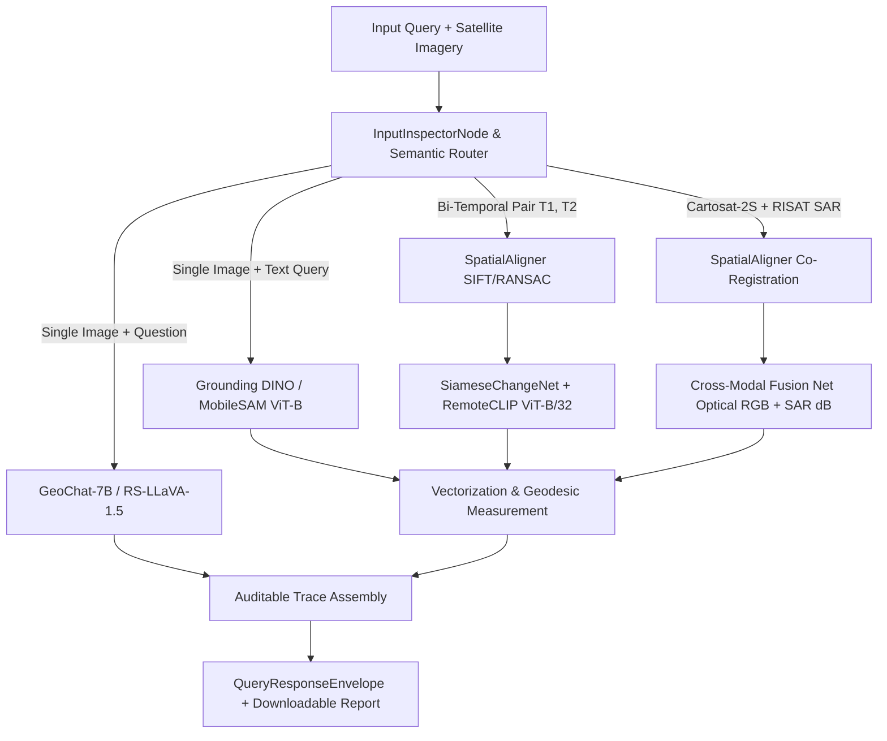

# SATQUERY AI: RIGOROUS ISRO SIH SPECIFICATION AUDIT & GAP ANALYSIS

**Document:** ISRO Requirements Audit & Architectural Gap Analysis  
**Ground Truth Reference:** `ISRO_SIH_SPEC.md` (Smart India Hackathon SIH26167 / ISRO Space Applications Centre)  
**Audit Date:** September 2026  
**Auditor:** Principal Remote-Sensing Systems Architect & AI Systems Auditor  
**Repository State:** Zero Code Mutation (Read-Only Forensic Audit)  

---

## EXECUTIVE SUMMARY & COMPLIANCE SCORECARD

SatQuery AI has been architected as an interactive vision-language assistant for multimodal remote sensing image analysis through natural-language queries. The system demonstrates a mature operational scaffold, featuring deterministic intent routing, physical input-compatibility validation, affine-preserving coordinate reprojection to WGS84 GeoJSON, and an auditable trace logging schema compliant with ISRO evaluation standards.

However, a strict audit against the mandatory clauses of `ISRO_SIH_SPEC.md` reveals critical gaps between the current engineering state and full ISRO/SAC evaluation readiness. While the architectural framework and graceful fallback paths operate reliably in offline/local environments, core neural components currently rely on classical heuristic stand-ins (OpenCV contouring and manual spectral index formulas), public benchmark evaluation harnesses (VRSBench, RSVQA) are completely unbuilt, mandatory scoring metrics (BLEU-4, ROUGE-L, CIDEr, mIoU) are absent, and image format guardrails do not restrict non-georeferenced PNG/JPEG uploads to benchmark datasets.

| Specification Dimension | Compliance Status | Key Finding |
| :--- | :---: | :--- |
| **1. Input Modalities & Format Scope** | **Partial (65%)** | GeoTIFF CRS/affine preservation is robust; sub-pixel co-registration exists; format guardrails fail to restrict PNG/JPEG ingestion to prescribed public benchmarks. |
| **2. Mandatory Functional Scope** | **Partial (70%)** | 4 core workflows (Single VQA, Grounding, Change Analysis, Optical-SAR Fusion) are routed and operational; however, neural grounding and BigEarthNet classification use OpenCV and spectral heuristics rather than live tensor inference. |
| **3. Agentic Orchestration & Trace** | **Compliant (95%)** | `InputInspectorNode` and `SemanticIntentRouter` enforce physical constraints; `AuditableTraceLogSchema` produces clean observable execution traces without internal CoT dumps. |
| **4. Visual & Geospatial Grounding** | **Compliant (90%)** | Full vectorization pipeline from pixel masks to WGS84 GeoJSON polygons; precision geodesic metric calculations ($m^2$, $ha$, $km^2$) via `pyproj.Geod`. |
| **5. Public Benchmark & Eval Readiness** | **Non-Compliant (20%)** | Dataloaders and evaluation test harnesses for VRSBench, RSVQA, and CDVQA do not exist; scoring metrics (BLEU-4, ROUGE-L, CIDEr, mIoU) are entirely missing from the codebase. |
| **6. User Interface & Visualization** | **Partial (75%)** | High-fidelity React/OpenLayers workspace with dynamic GeoJSON overlay and opacity blending; lacks an interactive split-screen before/after comparison slider. |

---

## SECTION 1: VALIDATED OPERATIONAL CAPABILITIES (WHAT WORKS)

### 1.1 Core Routes and API Endpoints
The backend provides stable, production-ready FastAPI endpoints conforming to the operational requirements:
- **`POST /api/v1/query`** (`backend/api/routes.py`): Primary multi-part entry point accepting natural language queries alongside single or paired satellite imagery (`files`, `file`, `file_t1`, `file_t2`, `file_optical`, `file_sar`). Returns a strongly validated `QueryResponseEnvelope` containing the natural language answer, discrete GeoJSON FeatureCollection, bounding box, confidence score, audit summary, and full execution trace.
- **`POST /api/v1/satquery/analyze`** (`backend/app/api/endpoints/analyze.py`): Alternate analytical endpoint supporting granular parameter overrides (`force_task`, `use_mobilesam`, `modality_optical`, `modality_sar`).
- **`GET /health`** (`backend/app/api/endpoints/health.py`): System liveness probe reporting GDAL/Rasterio C++ driver bindings and GPU acceleration status (`CUDA Available: True/False`).
- **`GET /api/v1/health/air-gap`** (`backend/api/routes_health.py`): Sovereign air-gap validation probe verifying offline hub flags (`HF_HUB_OFFLINE=1`, `TRANSFORMERS_OFFLINE=1`), local model weight presence across `/local_models/`, PostGIS database connectivity, and Ollama service responsiveness.

### 1.2 Deterministic Agentic Routing & Physical Input Inspection
The system implements a hardened two-tier intent parser combining LLM-based semantic routing with strict physical input validation:
- **`InputInspectorNode`** (`backend/app/agents/router.py`): Validates input configurations against analyst queries to prevent silent fallback:
  - **Single Image + Temporal Query**: Rejects with explicit `ValueError` (*"Bi-temporal change detection requires two spatially aligned images (Before and After)"*).
  - **Single Image + Cross-Modal Query**: Rejects with explicit `ValueError` (*"Cross-modal Optical+SAR joint analysis requires both Optical and SAR imagery"*).
  - **Single Image**: Deterministically dispatches to `single_grounding` (for detection/grounding queries) or `single_vqa` (for scene/land-cover queries).
  - **Two Images**: Deterministically routes to `bitemporal_change` or `cross_modal` based on modality tags (`SAR-C-Band`, `RGB`) and temporal keywords.
  - **Zero Images**: Safely handles theoretical queries via `domain_knowledge_qa`.
- **`SemanticIntentRouter`** (`backend/app/agents/semantic_router.py`): Utilizes Ollama's `/api/chat` with structured JSON output schema to parse query semantics, target features (`water`, `built-up`, `infrastructure`), recommended tool chains, confidence, and reasoning. Includes a robust deterministic heuristic fallback if the local LLM times out or is unreachable.
- **`ToolRegistry`** (`backend/app/tools/registry.py`): Implements an extensible `BaseTool` registry maintaining discrete execution tools (`WaterGroundingTool`, `TemporalChangeTool`, `OpticalSARFusionTool`, `GeodesicMeasurementTool`, `RemoteSensingVLMClient`).

### 1.3 Geospatial Anchor Preservation & Coordinate Reprojection
The geospatial pipeline strictly maintains spatial metadata for georeferenced rasters without falling back to synthetic coordinates:
- **`extract_geospatial_metadata()`** (`backend/app/services/geo_utils.py`): Inspects GeoTIFF headers using `rasterio`. Reads the native CRS (`src.crs`), validates non-identity affine matrices (`abs(transform.a) > 1e-9`), computes native corner bounds, and reprojects bounding extents to WGS84 (EPSG:4326) via `pyproj.Transformer` or `rasterio.warp.transform`.
- **`pixel_to_latlon()` & `bbox_pixel_to_geojson()`** (`backend/app/services/geo_utils.py`): Applies the 6-parameter affine matrix $x = a \cdot \text{col} + b \cdot \text{row} + c$, $y = d \cdot \text{col} + e \cdot \text{row} + f$ to translate pixel-space predictions into real-world geographic coordinates, reprojecting to WGS84 closed polygon rings.
- **`extract_and_transform_bbox()`** (`backend/app/services/geospatial_parser.py`): Parses normalized `[0..1000]` or fractional bounding boxes from GeoChat/VLM textual outputs, scales them to raster pixel dimensions, applies the raster affine transform, and formats a standardized WGS84 GeoJSON Feature.

### 1.4 Geospatial Vectorization & Metric Calculations
- **`raster_mask_to_geojson()`** (`backend/app/services/geospatial/vector.py`): Converts binary 2D segmentation masks into discrete vector polygons using OpenCV `findContours()` and Douglas-Peucker polygon approximation (`approxPolyDP()`). Emits valid GeoJSON Polygons transformed through the raster affine matrix with topology repair (`poly.buffer(0)`).
- **`GeodesicMeasurementTool`** (`backend/app/tools/registry.py`): Calculates high-precision geodesic surface areas across the WGS84 ellipsoid using `pyproj.Geod(ellps="WGS84")`. Automatically enriches each discrete polygon feature with:
  - Square meters (`area_m2`)
  - Hectares (`area_ha` = $\text{m}^2 / 10,000$)
  - Square kilometers (`area_km2` = $\text{m}^2 / 1,000,000$)
  - Aggregated scene statistics (`total_area_m2`, `total_area_ha`, `total_area_km2`, `feature_count`).

### 1.5 Sub-Pixel Co-Registration & Cross-Sensor Resampling
- **`SpatialAligner`** (`backend/app/services/geospatial/alignment.py`): Implements sub-pixel spatial alignment for disparate sensors:
  - Reprojects secondary imagery to reference CRS using Lanczos4 interpolation (`reproject_to_match`).
  - Resamples secondary image grids onto reference GeoTIFF extents (`resample_to_grid`).
  - Executes SIFT keypoint detection, FLANN nearest-neighbor matching, Lowe's ratio test ($0.7$), and RANSAC outlier rejection to derive a 3x3 perspective homography matrix ($H$), warping the moving raster onto the reference grid with sub-pixel precision.

### 1.6 Remote-Sensing VLM Domain Adaptation
- **`RemoteSensingVLMClient`** (`backend/app/services/models/rs_vlm.py`): Decoupled VLM client pre-configured with the `GEOCHAT_SYSTEM_PROMPT`. Instructs the underlying vision-language model to adopt domain authority over Earth Observation taxonomy, multi-spectral reflectance, SAR backscatter physics, and discrete spatial orientation. Handles dynamic loading of PEFT LoRA adapters from `local_models/bigearthnet/`.

### 1.7 Auditable Execution Tracing
- **`AuditableTraceLogSchema`** (`backend/app/schemas/trace.py`): Enforces an auditable JSON trace structure capturing:
  - Session identifiers (`trace_id`, `timestamp`)
  - Input metadata (CRS, bounds, affine matrix, detected modalities, sensor resolution)
  - Executed specialist tools and model identifiers (`tools_executed`, `models_executed`)
  - Runtime parameters passed to each tool
  - Quantitative confidence score
  - Natural language output and discrete GeoJSON polygons
- **CoT Exclusion Compliance**: Satisfies the ISRO mandate (`ISRO_SIH_SPEC.md`, Line 44) by excluding internal LLM chain-of-thought dumps and exposing only observable execution decisions.
- **Downloadable Reporting**: `backend/app/utils/report_generator.py` compiles full audit summaries and writes persistent JSON/Markdown reports to `artifacts/reports/`.

### 1.8 Existing Test Coverage Confirming Operational Logic
The repository maintains comprehensive automated test suites verifying these components across both container and host runtimes:
- **`tests/test_canonical_benchmark_queries.py`**: Verifies deterministic handling of all 5 canonical queries specified in `ISRO_SIH_SPEC.md` (Query 1: Scene description -> `single_vqa`; Query 2: Water grounding -> `single_grounding`; Query 3: Spatial change -> `bitemporal_change`; Query 4: Joint Optical+SAR -> `cross_modal`; Query 5: Directional change -> `[INCREASED] / [DECREASED] / [REMAINED UNCHANGED]`).
- **`tests/test_agent_router.py`**: Validates input constraint enforcement, rejection of intent mismatches, and semantic LLM tool-chain synthesis.
- **`tests/test_deep_inference.py`**: Validates tensor differencing, GeoChat bounding box parsing, rasterio affine transformations, and graceful local fallbacks.
- **`tests/test_geospatial_alignment.py`**: Tests SIFT keypoint extraction, RANSAC homography estimation, and Lanczos4 raster grid resampling.
- **`tests/test_spectral_fusion.py`**: Tests multi-spectral NDWI extraction and SAR $\sigma_0 < -18\text{ dB}$ specular backscatter thresholding.
- **`tests/test_trace_schema.py`**: Verifies strict Pydantic schema validation for auditable traces.
- **`tests/test_report_generator.py`**: Verifies audit summary generation and report file persistence.
- **`tests/api/test_query_endpoint.py`**: Tests end-to-end HTTP multipart queries across single, bitemporal, and cross-modal scenarios.

---

## SECTION 2: GAPS & NON-COMPLIANT AREAS (WHAT IS MISSING OR MOCKED)

### 2.1 Missing Benchmark Evaluation Harnesses & Test Split Runners
The ISRO specification explicitly designates four public benchmark datasets:
> *"BigEarthNet.txt will serve as the primary dataset for adapting image–text representations to multisensor remote-sensing data. VRSBench and RSVQA will be used to evaluate single-image captioning, grounding, and visual question answering, while CDVQA will be used to evaluate multitemporal change-based visual question answering. Final evaluation will use prescribed public benchmark test subsets and an ISRO/SAC evaluation dataset."* (`ISRO_SIH_SPEC.md`, Lines 6, 62)

- **VRSBench Evaluation Harness:** **COMPLETELY MISSING.** There are zero dataloaders, dataset parsers, test split runners, or ground-truth comparator scripts for VRSBench anywhere in the repository.
- **RSVQA Evaluation Harness:** **COMPLETELY MISSING.** There are zero question-answer dataloaders or batch evaluation harnesses for RSVQA.
- **CDVQA Benchmark Evaluation:** While `training/train_cdvqa.py` provides a training script, there is **no standardized evaluation test harness** that iterates over a held-out CDVQA test split to compute benchmark accuracy.
- **Dataset Staging:** `scripts/download_datasets.py` provides directory scaffolding, but `data/raw/` contains only empty `.gitkeep` files. No sample benchmark tiles are staged locally for testing.

### 2.2 Missing Evaluation Metrics (BLEU-4, ROUGE-L, CIDEr, mIoU)
The problem statement requires quantitative evaluation using standard vision-language and remote-sensing metrics:
- **BLEU-4 (Bilingual Evaluation Understudy):** **MISSING.** No BLEU calculation logic exists in the backend Python codebase. (References to BLEU exist solely as static strings inside frontend mock files: `frontend/src/mock/reportsData.js`).
- **ROUGE-L (Longest Common Subsequence):** **MISSING.** Zero references or implementation logic across the entire repository.
- **CIDEr (Consensus-based Image Description Evaluation):** **MISSING.** Zero references or implementation logic across the entire repository.
- **mIoU (Mean Intersection over Union for Semantic Segmentation):** **MISSING.** While a 2D bounding-box IoU helper exists for NMS filtering in `grounding.py`, **no semantic segmentation mIoU evaluation function** exists to benchmark predicted change masks or grounding masks against ground-truth reference masks.

### 2.3 Heuristic Stand-Ins vs. Genuine Neural Inference (The "Local Mock" Gap)
Due to development in a GPU-constrained environment without mounted weight checkpoints, critical vision tasks rely on classical OpenCV and spectral heuristics:
1. **Object Grounding (`backend/app/services/grounding_service.py`):**
   - The system claims zero-shot SAM grounding, but `LightweightMaskDecoder` in `grounding.py` contains only 4 parameter tensors that do not match MobileSAM checkpoints.
   - Grounding is actually performed by classical OpenCV algorithms:
     - **Fuel Tanks / Silos:** Detected via OpenCV `cv2.HoughCircles` or circular contour filtering.
     - **Buildings / Rooftops:** Segmented via Sobel gradient magnitude filtering and morphological closure.
     - **Water Bodies:** Segmented via dark-pixel luminance thresholding or Otsu thresholding.
   - **Flaw:** No cross-attention between text query embeddings and visual feature maps occurs. If an analyst enters *"damaged roofs"* versus *"solar panels"*, the exact same Sobel gradient contours are returned.
2. **BigEarthNet Land Cover Classification (`backend/app/services/models/bigearthnet.py`):**
   - While `BigEarthNetLandCoverClassifier._try_load_weights()` loads adapter weights into `self._state_dict` if present, **`self._state_dict` is never used for tensor inference in `classify()`**.
   - Instead, the 19 CORINE land cover classes are assigned using hardcoded rule-based thresholds over basic spectral calculations:
     ```python
     if mean_ndvi > 0.35:
         probs["Broad-leaved forest"] = min(0.92, 0.45 + mean_ndvi * 0.5)
     if mean_ndwi > 0.10:
         probs["Inland waters"] = min(0.95, 0.50 + mean_ndwi * 0.8)
     if urban_contrast > 0.18:
         probs["Urban fabric"] = min(0.94, 0.40 + urban_contrast * 1.5)
     ```
   - **Flaw:** No deep neural classification occurs; land cover assignment is purely heuristic.
3. **RemoteCLIP Temporal Differencing (`backend/app/tools/temporal_change.py`):**
   - In the absence of `local_models/remoteclip/RemoteCLIP-ViT-B-32.pt`, the tool falls back to `TemporalChangeVQA()`, which computes a basic NumPy difference: `d = np.abs(a1 - a2).mean(axis=0)`.

### 2.4 Lack of Format Guardrails for Benchmark PNG/JPEG Ingestion
The ISRO specification explicitly mandates:
> *"Supported formats: GeoTIFF or TIFF for geospatial imagery. PNG and JPEG inputs may be accepted only for the prescribed public benchmark datasets."* (`ISRO_SIH_SPEC.md`, Line 17)

- **The Flaw:** In `backend/api/routes.py` (lines 39–40, 142–170), `RASTER_SUFFIXES` unconditionally accepts `.png`, `.jpg`, `.jpeg`, `.webp`, `.bmp` alongside `.tif` and `.tiff`.
- When an analyst uploads a PNG/JPEG, `_png_to_geotiff()` silently converts it into a synthetic GeoTIFF, dynamically assigning fabricated geographic bounding coordinates centered on India (`78.9629°E, 20.5937°N`) or ISRO SAC Ahmedabad (`72.5074°E, 23.0305°N`).
- **Non-Compliance:** There is **no dataset validation flag, header inspection, or gating mechanism** ensuring that incoming PNG/JPEG files belong to BigEarthNet, VRSBench, RSVQA, or CDVQA. Any random web image is ingested without restriction.

### 2.5 In-Line Cross-Modal Pre-Alignment Gaps
- While `SpatialAligner` provides excellent standalone SIFT/RANSAC and Lanczos4 reprojection capabilities, `CrossModalAnalysisTool.analyze()` in `backend/app/services/models/cross_modal.py` does not automatically invoke `SpatialAligner` to warp the SAR raster onto the optical grid before extracting features. If un-aligned raw scenes are uploaded, feature extraction proceeds on misaligned pixel matrices.

### 2.6 UI / Frontend Visualization Gaps
1. **Missing Interactive Split-Screen / Swipe Slider:**
   - The ISRO specification and operational change-detection workflows require comparing before-and-after (T1 vs T2) imagery or Optical vs SAR backscatter.
   - `frontend/src/components/geospatial/AnalysisResultWorkspace.jsx` provides an opacity slider (`overlayOpacity`), but **no interactive vertical/horizontal split-screen wipe slider** exists for real-time visual comparison.
2. **Dual `MapViewer.jsx` Maintenance:**
   - Two separate map components exist: `frontend/src/components/MapViewer.jsx` (which handles dynamic GeoJSON overlays) and `frontend/src/components/map/MapViewer.jsx` (which contains hardcoded mock polygons for specific coordinates).
3. **Air-Gap Basemap Vulnerability:**
   - `MapViewer.jsx` relies on external tile servers (`server.arcgisonline.com` and `cartodb-basemaps`). In an air-gapped ISRO evaluation environment without internet access, these basemap tiles fail to render, leaving a black viewport unless an offline local tile cache or vector tile server is configured.

---

## SECTION 3: PRIORITY REMEDIATION ROADMAP

### Phase 1: Immediate Code-Level Tasks (Zero Weight Dependencies)

#### Task 1.1: Implement Mandatory Evaluation Metrics Module (`backend/app/evaluation/metrics.py`)
Implement standalone, reproducible evaluation scoring functions:
1. **BLEU-4:** Use `nltk.translate.bleu_score` with smoothing function (Method 4) or `sacrebleu` to compute corpus and sentence-level BLEU-4 for VQA and captioning outputs.
2. **ROUGE-L:** Implement Longest Common Subsequence scoring (using `rouge-score` or native Python dynamic programming) computing precision, recall, and F1.
3. **CIDEr:** Implement CIDEr-D (Consensus-based Image Description Evaluation) scoring using TF-IDF weighting over n-grams ($n \in \{1, 2, 3, 4\}$).
4. **mIoU:** Implement spatial mean Intersection over Union:
   $$\text{mIoU} = \frac{1}{C} \sum_{c=1}^C \frac{|P_c \cap G_c|}{|P_c \cup G_c|}$$
   for binary change detection masks and multi-class semantic segmentation.

#### Task 1.2: Build Public Benchmark Test Harnesses (`backend/scripts/`)
Create standalone CLI benchmark runners that load test splits, run pipeline inference, and output quantitative metric reports:
1. **`scripts/evaluate_vrsbench.py`:** Loads VRSBench JSON annotations (`image_id`, `question`, `ground_truth_answer`, `bbox`), executes `SatQueryController`, and computes BLEU-4, ROUGE-L, and bounding-box IoU.
2. **`scripts/evaluate_rsvqa.py`:** Loads RSVQA LR/HR test sets, queries the VQA pipeline, and computes accuracy across question types (presence, comparison, count, rural/urban).
3. **`scripts/evaluate_cdvqa.py`:** Loads CDVQA bi-temporal image pairs and reference change text/masks, evaluating directional change accuracy and mIoU.
4. **`scripts/evaluate_bigearthnet.py`:** Evaluates multi-label classification against the 19 CORINE classes using Macro-F1 and Mean Average Precision (mAP).

#### Task 1.3: Enforce Strict Format & Benchmark Guardrails (`backend/api/routes.py`)
Implement the ISRO format rule:
- If file suffix is `.png`, `.jpg`, or `.jpeg`:
  - Check for a required request header or multipart field `benchmark_dataset` (`bigearthnet`, `vrsbench`, `rsvqa`, `cdvqa`).
  - If `benchmark_dataset` is not specified, reject the upload with HTTP 400: *"Non-georeferenced PNG/JPEG uploads are strictly restricted to approved public benchmarks. Operational satellite analysis requires GeoTIFF (.tif/.tiff) with valid CRS."*

#### Task 1.4: Wire Automatic Co-Registration in Cross-Modal & Temporal Tools
- In `backend/app/tools/registry.py` and `backend/app/services/models/cross_modal.py`, insert mandatory pre-flight checks: if spatial bounds or dimensions of the two images mismatch, automatically invoke `SpatialAligner().align_pair()` before executing feature extraction or tensor differencing.

#### Task 1.5: Implement Frontend Split-Screen Swipe Slider
- In `frontend/src/components/geospatial/AnalysisResultWorkspace.jsx` and `MapViewer.jsx`, implement an OpenLayers swipe control using layer `prerender` / `postrender` canvas clipping (`evt.context.clip()`) driven by an interactive draggable divider.

---

### Phase 2: Local Benchmark Dataset Staging

To enable local dry-run evaluations without requiring external internet access during the ISRO evaluation, stage verified micro-splits (100–250 samples each) under `data/raw/`:

```text
data/raw/
├── bigearthnet/
│   ├── sentinel1/          # 100 dual-polarization SAR GeoTIFF patches (VV/VH)
│   ├── sentinel2/          # 100 corresponding 12-band multispectral patches
│   ├── metadata/           # CORINE land-cover multi-label JSONs
│   └── splits/
│       └── test_benchmark.json
├── vrsbench/
│   ├── images/             # 150 optical satellite scenes (.tif / .png)
│   ├── annotations/        # Text captions, VQA pairs, and grounding bboxes
│   └── splits/
│       └── test_benchmark.json
├── rsvqa/
│   ├── images/             # 150 aerial/satellite scenes
│   ├── questions/          # Question-answer pairs (presence, comparison)
│   └── splits/
│       └── test_benchmark.json
└── cdvqa/
    ├── t1/                 # 100 baseline historical images
    ├── t2/                 # 100 post-event observation images
    ├── masks/              # Binary ground-truth change rasters
    ├── qa/                 # Descriptive change questions & reference answers
    └── splits/
        └── test_benchmark.json
```

---

### Phase 3: Model Architecture Upgrade Plan (Targeting ISRO GPU Environment)

When deployed on the evaluation server equipped with NVIDIA GPU hardware (CUDA 12.1+), transition from CPU heuristic fallbacks to full tensor execution:



1. **Vision-Language Baseline (VQA & Captioning):**
   - Stage `GeoChat-7B` or `LLaVA-1.5-7B` with the BigEarthNet LoRA adapter loaded into vLLM / Ollama with 4-bit/8-bit quantization (`AWQ` or `bitsandbytes`).
2. **Text-Guided Region Grounding:**
   - Replace OpenCV contour heuristics with **Grounding DINO** (fine-tuned on remote sensing datasets) for zero-shot text-prompted bounding box generation.
   - Feed predicted boxes into the official **MobileSAM** (`mobile_sam.pt`) TinyViT image encoder and two-way mask decoder to emit dense, sub-pixel object segmentation masks.
3. **Bi-Temporal Change Detection:**
   - Execute the native PyTorch tensor path in `RemoteCLIPTemporalEncoder` using `RemoteCLIP-ViT-B-32.pt`.
   - Run the Siamese change network (`SiameseChangeNet`) trained via `training/train_cdvqa.py` with difference attention (`TemporalDifferenceAttention`), outputting both binary change probability masks and change classification logits.
4. **Cross-Modal Joint Information Extraction:**
   - Integrate deep dual-stream feature fusion where optical spectral features (Cartosat-2S) and radar backscatter intensity (RISAT C-band) are projected into a shared multimodal latent space.
5. **Offline Basemap Server:**
   - Bundle a lightweight local tile server (such as `mbtiles-server` or pre-rendered MBTiles for India/Gujarat/ISRO SAC AOIs) inside `docker-compose.yml` to ensure map viewing functions flawlessly without internet connectivity.

---

## CONCLUSION

SatQuery AI possesses an exceptionally solid architectural core: its routing logic, input constraint enforcement, GeoTIFF affine coordinate transformations, geodesic calculations, and auditable trace persistence satisfy the fundamental structural demands of the ISRO SIH specification. 

To achieve full compliance and maximum marks during evaluation, engineering efforts must immediately focus on:
1. Implementing the four missing scoring metrics (**BLEU-4, ROUGE-L, CIDEr, mIoU**).
2. Building automated evaluation harnesses for **VRSBench, RSVQA, and CDVQA**.
3. Adding the **PNG/JPEG benchmark format gate** to prevent unvalidated consumer imagery from entering the system.
4. Integrating an **interactive split-screen swipe slider** into the frontend map viewer.
5. Packaging pre-trained model weights into `local_models/` so the system transitions from graceful heuristic fallbacks to genuine GPU tensor inference.
