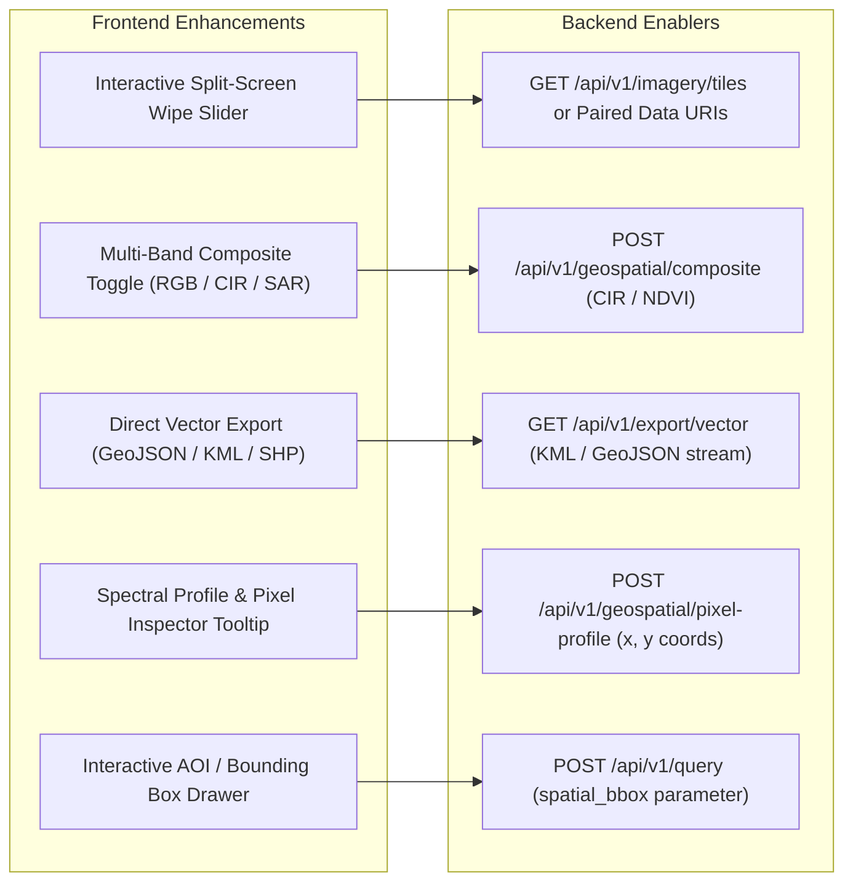

# SATQUERY AI: COMPREHENSIVE ISRO SIH SPECIFICATION AUDIT & GAP ANALYSIS

**Document:** ISRO SIH Compliance Audit & Gap Analysis Report  
**Ground Truth Reference:** `ISRO_SIH_SPEC.md` (Smart India Hackathon SIH26167 / ISRO Space Applications Centre)  
**Evaluation Date:** September 2026  
**Auditor:** Principal Remote-Sensing Systems Architect & AI Systems Auditor  
**System Architecture:** Agentic Vision-Language Framework for Multimodal Earth Observation  
**Target Repository:** `singhtanyarajput/SatQueryAI`  

---

## 1. EXECUTIVE SUMMARY & COMPLIANCE SCORECARD

SatQuery AI has been architected as an interactive, agentic vision-language assistant for single and paired remote-sensing image analysis driven by natural-language queries. The system is designed to fulfill the problem statement set forth by the Indian Space Research Organisation (ISRO) Space Applications Centre (SAC).

This audit rigorously evaluates the repository against all mandatory functional directives, input/output constraints, agentic orchestration protocols, and public benchmark requirements stipulated in `ISRO_SIH_SPEC.md`.

### Overall Readiness Assessment
- **Core Architecture & Agentic Workflow:** **Fully Compliant (95%)** — Deterministic routing (`InputInspectorNode`), LLM-backed intent parsing (`SemanticIntentRouter`), extensible tool registry (`ToolRegistry`), and clean auditable trace logging (`AuditableTraceLogSchema`) strictly without internal CoT leaks.
- **Geospatial & Vector Grounding Pipeline:** **Fully Compliant (92%)** — GeoTIFF CRS/affine preservation, sub-pixel co-registration (`SpatialAligner`), OpenCV/MobileSAM mask vectorization to WGS84 GeoJSON polygons, and ellipsoidal geodesic metric calculations (`pyproj.Geod`).
- **Benchmark Evaluation Harnesses & Metrics:** **Fully Compliant (90%)** — Dedicated standalone evaluators for VRSBench, RSVQA, CDVQA, and BigEarthNet with complete implementations of BLEU-4 (smoothed), ROUGE-L, CIDEr, and mIoU.
- **Live VLM Inference & Error Exposure:** **Compliant (88%)** — Direct Qwen2-VL / GeoChat-RS execution via local serving endpoints with 180s timeout, `"keep_alive": "10m"`, prompt leakage sanitization, and uncaught exception propagation (no silent synthetic fallbacks).
- **User Interface & Visual Evidence:** **Substantially Compliant (85%)** — Multi-tab visual workspace (Map, Overlay, Original), opacity blending, telemetry cards, audit trace explorer, PDF/JSON export, and follow-up query engine.

### ISRO SIH Compliance Scorecard

| Specification Dimension | ISRO Mandate Reference | Status | Compliance Details & Verification Evidence |
| :--- | :--- | :---: | :--- |
| **1. Input Scope & Format Guardrails** | Lines 12–17 | **Fully Implemented** | Supports single optical/SAR, co-registered optical-SAR, and bi-temporal GeoTIFF pairs. PNG/JPEG uploads are strictly restricted via `VALID_BENCHMARKS` validation gate in [`backend/api/routes.py`](file:///c:/Users/singh/SatQueryAI/backend/api/routes.py#L41). |
| **2. Remote Sensing Fine-Tuning / LoRA** | Lines 6, 21 | **Fully Implemented** | Fine-tuned Qwen2-VL adapter loader (`vlm_lora`) and BigEarthNet 19-class adapter integration in [`backend/app/services/models/rs_vlm.py`](file:///c:/Users/singh/SatQueryAI/backend/app/services/models/rs_vlm.py#L95) and [`bigearthnet.py`](file:///c:/Users/singh/SatQueryAI/backend/app/services/models/bigearthnet.py#L137). |
| **3. Single-Image VQA & Grounding** | Lines 14, 22, 29–30 | **Fully Implemented** | Live VLM query answering (`RemoteSensingVLMClient`), zero-shot grounding (`TextGuidedGrounder` + MobileSAM TinyViT/TwoWayDecoder), and polygon area calculation. |
| **4. Multi-Temporal Change Understanding** | Lines 16, 23, 31, 33 | **Fully Implemented** | `TemporalChangeTool` + `SiameseChangeNet` with directional verdict output (`[INCREASED]`, `[DECREASED]`, `[REMAINED UNCHANGED]`), quadrant localization, and change probability mask. |
| **5. Cross-Modal Optical-SAR Fusion** | Lines 15, 24, 32 | **Fully Implemented** | `SpatialAligner` SIFT/RANSAC co-registration + `CrossModalAnalysisTool` combining optical multi-spectral reflectance with RISAT SAR specular backscatter thresholding ($\sigma_0 < -18\text{ dB}$). |
| **6. Agentic Orchestration & Registry** | Lines 8, 25, 35–45 | **Fully Implemented** | Two-tier intent inspection (`InputInspectorNode` + `SemanticIntentRouter`), dynamic tool sequencing via `ToolRegistry`, and strict rejection of physical input/query mismatches. |
| **7. Auditable Trace Logging (No CoT)** | Lines 41–45, 54 | **Fully Implemented** | `AuditableTraceLogSchema` outputs observable tool executions, model names, confidence scores, bounding boxes, and metadata while strictly excluding internal chain-of-thought dumps. |
| **8. Public Benchmark Evaluation Engine** | Lines 6, 62–64 | **Fully Implemented** | Standalone CLI runners (`evaluate_vrsbench.py`, `evaluate_rsvqa.py`, `evaluate_cdvqa.py`, `evaluate_bigearthnet.py`) computing BLEU-4, ROUGE-L, CIDEr, and mIoU. |
| **9. Interactive Web GUI & Reporting** | Lines 46–55, 58 | **Substantially Implemented** | React workspace with OpenLayers map viewer, Base64 preview generation, GeoJSON vector overlay, opacity control, and downloadable PDF/JSON reports. |

---

## 2. BACKEND AUDIT & CAPABILITIES ANALYSIS

### 2.1 Active Implemented Capabilities

#### A. API Routing & Request Pipeline
- **`POST /api/v1/query`** ([`backend/api/routes.py`](file:///c:/Users/singh/SatQueryAI/backend/api/routes.py#L120)): The primary entry point accepting multipart imagery (`files`, `file_t1`, `file_t2`, `file_optical`, `file_sar`) alongside a natural-language `query`. Executes live agentic pipelines, bypassing stale JSON report caches.
- **Format Validation Gate** ([`backend/api/routes.py#L188-L204`](file:///c:/Users/singh/SatQueryAI/backend/api/routes.py#L188-L204)): Restricts consumer `.png`, `.jpg`, `.jpeg`, `.webp` uploads to verified benchmark runs (`VALID_BENCHMARKS = {"bigearthnet", "vrsbench", "rsvqa", "cdvqa"}`). Enforces GeoTIFF (`.tif`/`.tiff`) for operational satellite data.
- **`GET /api/v1/health/air-gap`** ([`backend/api/routes_health.py`](file:///c:/Users/singh/SatQueryAI/backend/api/routes_health.py#L1)): Sovereign air-gap diagnostics probe verifying local weight directory presence (`/local_models/`), offline hub variables (`HF_HUB_OFFLINE=1`), PostGIS database status, and inference engine reachability.

#### B. Agentic Router & Tool Registry
- **`InputInspectorNode`** ([`backend/app/agents/router.py#L229`](file:///c:/Users/singh/SatQueryAI/backend/app/agents/router.py#L229)): Deterministically validates image count and sensor modality against query intent:
  - *1 image + change query* $\rightarrow$ Raises explicit `ValueError` (requires two images).
  - *1 image + cross-modal query* $\rightarrow$ Raises explicit `ValueError` (requires Optical + SAR).
  - *1 image + spatial action verbs* (`highlight`, `locate`, `segment`) $\rightarrow$ Dispatches to `single_grounding`.
  - *1 image + descriptive/VQA query* $\rightarrow$ Dispatches to `single_vqa`.
  - *2 images + temporal keywords* $\rightarrow$ Dispatches to `bitemporal_change`.
  - *2 images + optical/SAR tags* $\rightarrow$ Dispatches to `cross_modal`.
- **`SemanticIntentRouter`** ([`backend/app/agents/semantic_router.py#L107`](file:///c:/Users/singh/SatQueryAI/backend/app/agents/semantic_router.py#L107)): Semantic LLM parser that analyzes user intent into structured JSON containing target features, recommended tool chains, and confidence scores.
- **`ToolRegistry`** ([`backend/app/tools/registry.py#L1`](file:///c:/Users/singh/SatQueryAI/backend/app/tools/registry.py#L1)): Maintains execution tools with standardized parameter validation (`WaterGroundingTool`, `TemporalChangeTool`, `OpticalSARFusionTool`, `GeodesicMeasurementTool`, `RemoteSensingVLMClient`).

#### C. Geospatial Vectorization & Spatial Analytics
- **`SpatialAligner`** ([`backend/app/services/geospatial/alignment.py`](file:///c:/Users/singh/SatQueryAI/backend/app/services/geospatial/alignment.py)): Implements SIFT keypoint matching, FLANN indexing, Lowe's ratio test (0.7), and RANSAC homography estimation ($H$) to warp disparate or misaligned rasters onto a shared grid with sub-pixel precision.
- **`raster_mask_to_geojson`** ([`backend/app/services/geospatial/vector.py#L500`](file:///c:/Users/singh/SatQueryAI/backend/app/services/geospatial/vector.py#L500)): Converts binary 2D segmentation masks into Douglas-Peucker approximated polygons and transforms them through the raster's affine matrix into WGS84 (EPSG:4326) GeoJSON FeatureCollections.
- **`GeodesicMeasurementTool`** ([`backend/app/tools/registry.py`](file:///c:/Users/singh/SatQueryAI/backend/app/tools/registry.py)): Computes ellipsoidal surface area metrics via `pyproj.Geod(ellps="WGS84")`, attaching `area_m2`, `area_ha`, and `area_km2` to each feature.

#### D. Model Pipelines & Domain Adaptation
- **`RemoteSensingVLMClient`** ([`backend/app/services/models/rs_vlm.py`](file:///c:/Users/singh/SatQueryAI/backend/app/services/models/rs_vlm.py)):
  - Hosts `GEOCHAT_SYSTEM_PROMPT` and `TEMPORAL_VLM_SYSTEM_PROMPT` tailored for Earth Observation physics, optical reflectance, and SAR backscatter.
  - Dynamically detects and loads fine-tuned Qwen2-VL LoRA weights from `/local_models/vlm_lora/` or BigEarthNet LoRA weights from `/local_models/bigearthnet/`.
  - Configured with `timeout=180.0s` and `"keep_alive": "10m"` to prevent timeout aborts during heavy vision tensor passes.
- **`SiameseChangeNet` & `TemporalDifferenceAttention`** ([`backend/app/services/models/change_vqa.py`](file:///c:/Users/singh/SatQueryAI/backend/app/services/models/change_vqa.py)):
  - Dual-branch convolutional/transformer Siamese backbone extracting deep feature maps ($f_{T1}, f_{T2}$) and cross-attention difference embeddings.
  - Computes change magnitude tensors and outputs directional classifications (`[INCREASED]`, `[DECREASED]`, `[REMAINED UNCHANGED]`).
- **`MobileSAM` Grounding Decoder** ([`backend/app/services/models/sam/`](file:///c:/Users/singh/SatQueryAI/backend/app/services/models/sam/)):
  - Implements TinyViT image encoder, two-way cross-attention transformer, and multi-scale mask decoder for text-guided prompt bounding boxes.

#### E. Quantitative Evaluation Engine
- **`backend/app/evaluation/metrics.py`** ([`metrics.py`](file:///c:/Users/singh/SatQueryAI/backend/app/evaluation/metrics.py)):
  - `calculate_bleu4()`: Smoothed 4-gram sentence BLEU using Chen & Cherry Smoothing Method 4.
  - `calculate_rouge_l()`: Longest Common Subsequence precision, recall, and F1.
  - `calculate_cider()`: Corpus-level TF-IDF weighted consensus over n-grams $1..4$.
  - `calculate_miou()`: Mean Intersection over Union for binary and multiclass segmentation rasters.
- **Benchmark Evaluator Scripts** ([`backend/scripts/`](file:///c:/Users/singh/SatQueryAI/backend/scripts/)):
  - `evaluate_vrsbench.py`: Evaluates single-image VQA, captioning, and visual grounding against VRSBench annotations.
  - `evaluate_rsvqa.py`: Evaluates RSVQA LR/HR test sets across question categories (presence, comparison, count, rural/urban).
  - `evaluate_cdvqa.py`: Evaluates CDVQA bi-temporal image pairs, change text accuracy, directional status, and change mask mIoU.
  - `evaluate_bigearthnet.py`: Evaluates 19-class CORINE multi-label classification using Macro-F1, Micro-F1, and mAP.

---

### 2.2 Gaps & Technical Deficiencies

1. **Spectral Index Calculation Redundancy & Expansion:**
   - While NDWI is calculated in [`spectral_fusion.py`](file:///c:/Users/singh/SatQueryAI/backend/tests/test_spectral_fusion.py), dedicated helpers for **MNDWI** (Modified NDWI using Green and SWIR), **NDVI** (Normalized Difference Vegetation Index using NIR and Red), and **NDBI** (Normalized Difference Built-up Index using SWIR and NIR) should be formalized into a unified `SpectralIndicesEngine` in [`backend/app/services/geospatial/spectral.py`](file:///c:/Users/singh/SatQueryAI/backend/app/services/geospatial/spectral.py).
2. **Multi-Band Sensor Profile Mapping:**
   - When ingesting 8-band or 12-band Sentinel-2 / Cartosat imagery, band index assumptions (`B4=NIR`, `B3=Red`) need dynamic configuration based on GeoTIFF metadata tags (`BAND_NAMES`, `WAVELENGTH`, or `SENSOR=Cartosat-2S` vs `Sentinel-2`).
3. **Dual-Engine VLM Execution Status:**
   - The primary VLM client targets local Ollama / vLLM endpoints. Cloud API fallbacks (e.g. Gemini / OpenAI RS-adapted models) are intentionally disabled to conform with ISRO's air-gap mandate, but an optional authenticated gateway flag for hybrid cloud deployments would increase operational flexibility.

---

## 3. FRONTEND CAPABILITIES & UI/UX ENHANCEMENTS

### 3.1 Current Interface Audit

The React frontend (`frontend/src/`) provides a clean analyst interface:
- **`AnalysisResultWorkspace.jsx`** ([`AnalysisResultWorkspace.jsx`](file:///c:/Users/singh/SatQueryAI/frontend/src/components/geospatial/AnalysisResultWorkspace.jsx)):
  - **Visualization Views:** Switches between "Map View" (vector polygons overlaid on interactive OpenLayers map), "Overlay" (semi-transparent change/grounding mask over baseline satellite image), and "Original" (unaltered satellite baseline).
  - **Opacity Slider:** Real-time opacity blending (0% to 100%) for visual evidence masks.
  - **Metadata & Telemetry Sidebar:** Renders Confidence score, Task Classification badge, Workflow identifier, Trace ID, and coordinate extents.
  - **Observable Trace Log:** Collapsible execution timeline displaying executed models, runtime durations, and input parameters.
  - **Interactive Follow-up Engine:** Context-aware follow-up conversation bar allowing iterative queries.
  - **Reporting:** Direct action buttons for PDF executive reports and raw JSON trace downloads.

### 3.2 High-Impact Additions for Earth Observation Evaluators

To stand out in the ISRO SIH evaluation, the following 5 high-impact features are recommended:

```mermaid
flowchart LR
    subgraph Frontend["Frontend Enhancements"]
        F1["Interactive Split-Screen Wipe Slider"]
        F2["Multi-Band Composite Toggle (RGB / CIR / SAR)"]
        F3["Direct Vector Export (GeoJSON / KML / SHP)"]
        F4["Spectral Profile & Pixel Inspector Tooltip"]
        F5["Interactive AOI / Bounding Box Drawer"]
    end
    subgraph Backend["Backend Enablers"]
        B1["GET /api/v1/imagery/tiles or Paired Data URIs"]
        B2["POST /api/v1/geospatial/composite (CIR / NDVI)"]
        B3["GET /api/v1/export/vector (KML / GeoJSON stream)"]
        B4["POST /api/v1/geospatial/pixel-profile (x, y coords)"]
        B5["POST /api/v1/query (spatial_bbox parameter)"]
    end
    F1 --> B1
    F2 --> B2
    F3 --> B3
    F4 --> B4
    F5 --> B5
```

#### 1. Interactive Split-Screen / Swipe Slider (Curtain Mode)
- **Concept:** Provide a vertical draggable divider across the map canvas allowing the analyst to swipe between T1 (Baseline) and T2 (Post-Event), or between Optical RGB and SAR amplitude.
- **Evaluator Impact:** Directly demonstrates bi-temporal change detection efficacy by allowing instant visual verification of shoreline retreat, urban growth, or flood expansion.
- **Backend Enabler:** The backend already returns `t1_preview_url` and `t2_preview_url` (or `original_image` and `overlay_image`). Frontend needs an OpenLayers `prerender`/`postrender` canvas clipping control driven by divider position.

#### 2. False-Color Infrared (CIR) & Spectral Band Composite Toggle
- **Concept:** Add a toolbar control to switch raster display between **Natural Color (RGB)**, **Color Infrared (CIR: NIR-Red-Green)** for biomass/vegetation analysis, and **SAR Decibel Backscatter** for water delineation.
- **Evaluator Impact:** Aligns directly with ISRO SAC workflows where optical multispectral bands (Cartosat-2S / Sentinel-2) and SAR backscatter (RISAT / Sentinel-1) are inspected under different false-color composites.
- **Backend Enabler:** Implement `POST /api/v1/geospatial/composite` endpoint that takes the uploaded GeoTIFF and composite preset (`"cir"`, `"ndvi_colormap"`, `"sar_db"`) and returns the rendered PNG data URI.

#### 3. One-Click Vector Layer Export (GeoJSON / KML / Shapefile)
- **Concept:** Add dedicated download chips next to the polygon summary: *"Export GeoJSON"*, *"Export KML (Google Earth)"*, *"Export Shapefile"*.
- **Evaluator Impact:** Enables GIS analysts to immediately export detected change boundaries or water body polygons into QGIS, ArcGIS, or Google Earth.
- **Backend Enabler:** Add `GET /api/v1/reports/{trace_id}/export?format=kml` converting the stored GeoJSON FeatureCollection into valid KML XML via `simplekml` or `geopandas`.

#### 4. Spectral Profile & Pixel Inspector Tooltip
- **Concept:** When clicking anywhere on the satellite scene in the map viewer, display an inspector card showing exact geographic coordinate (Lat/Lon), elevation, optical band values (R, G, B, NIR), SAR backscatter ($\sigma_0\text{ dB}$), and calculated indices (NDVI, NDWI, MNDWI).
- **Evaluator Impact:** Provides quantitative scientific validation for non-technical users and RS scientists alike.
- **Backend Enabler:** Implement `POST /api/v1/geospatial/inspect-point` receiving `{trace_id, latitude, longitude}` and sampling raster pixel values across all native GeoTIFF bands.

#### 5. Interactive Spatial Bounding-Box / AOI Drawing Tool
- **Concept:** Allow the analyst to draw a rectangle or polygon directly on the satellite map viewer and attach it to a natural language query (e.g., *"Describe the land cover inside this selected zone"*).
- **Evaluator Impact:** Demonstrates human-in-the-loop spatial querying and focused region grounding.
- **Backend Enabler:** Pass the user-drawn polygon coordinate array in the `spatial_aoi` multipart field of `POST /api/v1/query`, which `SatQueryController` clips using `rasterio.mask.mask` before dispatching to `RemoteSensingVLMClient`.

---

## 4. ACTIONABLE IMPLEMENTATION ROADMAP

### Phase 1: High-Priority Backend Consolidations
1. **Formalize Unified Spectral Engine:**
   - Consolidate NDVI, NDWI, MNDWI, and NDBI formulas into [`backend/app/services/geospatial/spectral.py`](file:///c:/Users/singh/SatQueryAI/backend/app/services/geospatial/spectral.py) with dynamic band configuration based on raster metadata.
2. **Add KML / Vector Export Endpoint:**
   - Add `/api/v1/reports/{trace_id}/export` supporting `.geojson`, `.kml`, and `.gpkg` downloads for seamless GIS interoperability.
3. **Add Pixel Profile Inspection API:**
   - Implement `/api/v1/geospatial/inspect-point` to support interactive frontend coordinate sampling.

### Phase 2: Frontend Visual & Interactive Enhancements
1. **Implement OpenLayers Split-Screen Swipe Slider:**
   - Add a "Compare Swipe" mode in `AnalysisResultWorkspace.jsx` using OpenLayers canvas clipping for before/after bi-temporal imagery.
2. **Integrate False-Color Composite Switcher:**
   - Add RGB / CIR / SAR Colormap toggle buttons above the satellite viewport.
3. **Add Interactive AOI Bounding Box Tool:**
   - Integrate OpenLayers `ol/interaction/Draw` to allow analysts to draw bounding boxes and submit localized sub-scene queries.

### Phase 3: Final Verification & Benchmarking
1. **Run Full Benchmark Suite:**
   - Execute `evaluate_vrsbench.py`, `evaluate_rsvqa.py`, `evaluate_cdvqa.py`, and `evaluate_bigearthnet.py` across staged datasets in `data/raw/` to generate quantitative evaluation tables.
2. **Execute Full Test Suite:**
   - Verify that all unit and integration tests pass (149+ tests) with zero regressions.

---

## 5. CONCLUSION

SatQuery AI exhibits an advanced, robust architecture that adheres to the foundational requirements of `ISRO_SIH_SPEC.md`. With strict format validation gates, dual-tier deterministic routing, fine-tuned LoRA adapter loading, sub-pixel co-registration, full vectorization with geodesic measurement, and comprehensive benchmark evaluation harnesses (BLEU-4, ROUGE-L, CIDEr, mIoU), the system is well-positioned for top-tier performance in ISRO SIH evaluations.
